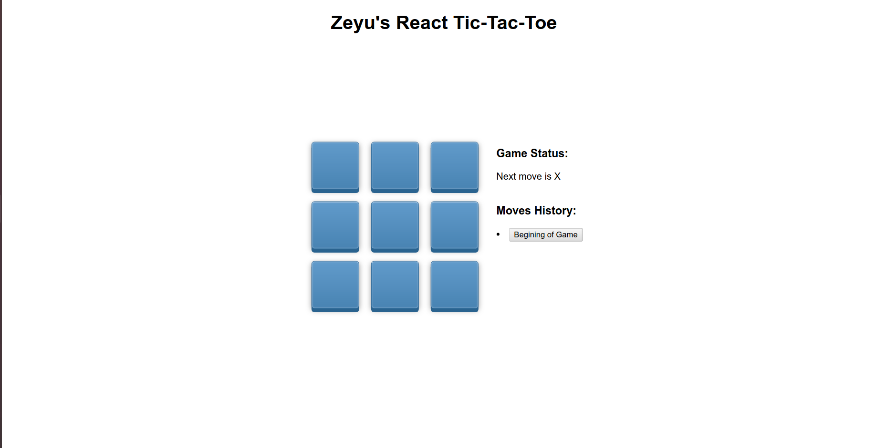
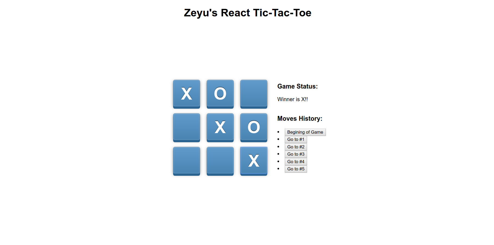

This project was bootstrapped with [Create React App](https://github.com/facebookincubator/create-react-app).

Below you will find some information on how to perform common tasks. 
You can find the most recent version of this guide [here](https://github.com/facebookincubator/create-react-app/blob/master/packages/react-scripts/template/README.md).

# Tic-Tac-Toe
Front-end app built in React

## game:
Game is built using React's built in state. 

